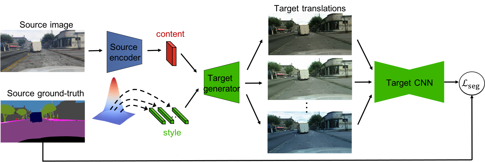

# Beyond deterministic translation for unsupervised domain adaptation
 

This is the PyTorch implementation of the following paper \
[Beyond deterministic translation for unsupervised domain adaptation](https://arxiv.org/abs/2010.07411) \
Eleni Chiou, Eleftheria Panagiotaki, Iasonas Kokkinos \
British Machine Vision Conference (BMVC), 2022

### Abstract
In this work we challenge the common approach of using a one-to-one mapping (‘translation’) between the source and target domains in unsupervised domain adaptation (UDA). Instead, we rely on stochastic translation to capture inherent translation ambiguities. This allows us to (i) train more accurate target networks by generating multiple outputs conditioned on the same source image, leveraging both accurate translation and data augmentation for appearance variability, (ii) impute robust pseudo-labels
for the target data by averaging the predictions of a source network on multiple translated versions of a single target image and (iii) train and ensemble diverse networks
in the target domain by modulating the degree of stochasticity in the translations. We report improvements over strong recent baselines, leading to state-of-the-art UDA results on two challenging semantic segmentation benchmarks.

 ### Installation / Setup:

This code was tested with Python 3.6, PyTorch 0.4.1, and CUDA 8.0/9.0.

1. Install PyTorch.
    ```
    conda install pytorch=0.4.1 torchvision cuda90 -c pytorch
    ```

2. Install additional dependencies.
    ```
    pip install -r requirements.txt
    ```

3. Clone the repo.
    ```
   git clone https://github.com/elchiou/Beyond-deterministic-translation-for-UDA.git
   ```

### Usage
1. Download the dataset you want to use. The dataset directories should have the following structure.
   ```
   <data_root>/GTA5/                               % GTA dataset root
   <data_root>/data/GTA5/images/                   % GTA images
   <data_root>/data/GTA5/labels/                   % Semantic segmentation labels
   ...
   ```
   ```
   <data_root>/data/Cityscapes/                       % Cityscapes dataset root
   <data_root>/data/Cityscapes/leftImg8bit            % Cityscapes images
   <data_root>/data/Cityscapes/leftImg8bit/val
   <data_root>/data/Cityscapes/gtFine                 % Semantic segmentation labels
   <data_root>/data/Cityscapes/gtFine/val
   ...
   ```
2. Setup the ./scripts/configs/config.yaml file.
3. Train the models using the following:
   ```
    ./scripts/train.sh
    ```
   The pretrained stochastic translation network can be downloaded [here](https://www.dropbox.com/scl/fo/jcv6nqu377nfjcjd78x7z/h?rlkey=uhfgbqxg6lun0dxpbkx4vwjiz&dl=0).

4. Evaluate the models using the following:
   ```
    ./scripts/test.sh
    ```
    The pretrained models for the 3 rounds of training on the GTA5 -> CityScapes using the DeepLab backbone can be downloaded [here](https://www.dropbox.com/scl/fo/9h1dvtt3rhubkow9fh4z2/h?rlkey=yvqmhwl51mxdgav332hw18tvs&dl=0).
5. Generate pseudolabels using the following:
    ```
    ./scripts/gen_pseudolabels.sh
    ```
### Acknowledgements
This codebase is heavily borrowed from [MUNIT](https://github.com/NVlabs/MUNIT) and [ADVENT](https://github.com/valeoai/ADVENT/).
